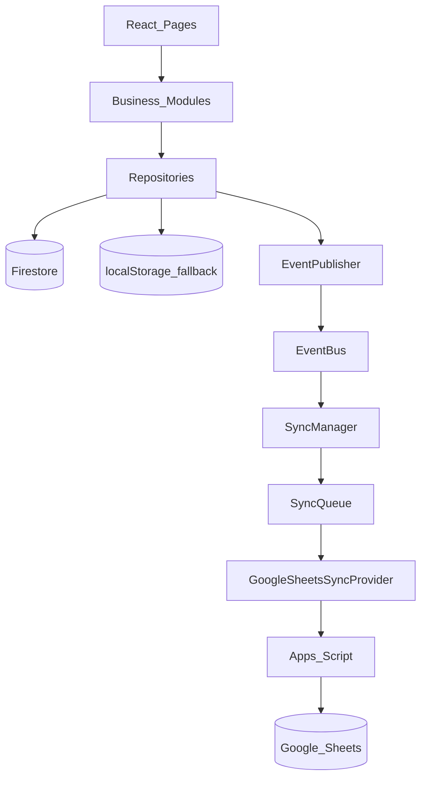

# RetailOS Developer Guide

## Adding a feature (example: Customer)

1. Add/extend types in `src/types` or the repository file.
2. Implement CRUD in `CustomerRepository` (Firestore collection `customers`).
3. Publish the right `EventTypes` after successful writes.
4. Expose `CustomerService` in `src/modules/customer` that only calls the repository.
5. UI pages call `CustomerService` — never `fetch` / Firestore / Sheets.

## Adding a sync destination (example: Tally)

1. Implement `SyncProvider` in `src/services/sync/TallySyncProvider.ts`.
2. Register it: `syncManager.registerProvider(new TallySyncProvider())` in bootstrap.
3. Do not touch React or Payment/Invoice modules.

## Adding a payment gateway

1. Implement `PaymentProvider` under `src/modules/payment/providers`.
2. Swap provider inside the payment module hook/service.
3. Still persist via `PaymentRepository.save/update` so events/sync keep working.

## Inventory / stock

1. Item CRUD → `ProductService` → `ProductRepository` (never mutate stock here).
2. Stock changes → `InventoryService.addStock` / `adjustStock` / `recordMovement` (always creates a movement).
3. POS must not call inventory from React — `InventoryEngine` listens to `PAYMENT_RECEIVED`.
4. Refund restock → `InventoryService.restockForRefund` from `RefundService`.
5. Tabular export helpers: `InventoryService.export*Data()`; Excel catalog import/export: `ProductImportService` (`/inventory/import`).
6. Routes: `/inventory/items`, `/inventory/import`, `/inventory/stock`, `/inventory/opening`, `/inventory/stock-take`, `/inventory/lots`, `/inventory/movements`, `/inventory/categories`.
7. Lots: GRN / opening / adjust-in create lots; sales / damage / wastage / adjust-out consume FEFO. Expiry write-off → `WASTAGE`.
8. Stock take → `StockTakeService.post` applies variance as ADJUSTMENT_IN/OUT.

## Cashier shifts / till

1. Open/close/cash in-out-drop → `ShiftService` → `CashierShiftRepository` (never Banking).
2. Cash sales/refunds/expenses → `TillEngine` on events (only if that cashier has an open shift).
3. Expected = opening + sales + cash in − refunds − expenses − cash out − drops − supplier cash.
4. UI: `/shifts` (admin, manager, cashier). Cashiers see own shifts; managers see all.
5. Banking remains store cashbook; till is cashier accountability.
6. Do not call Till from Payment/POS React — events only.

## Sales returns, exchanges & credit notes

1. Goods document → `SalesReturnService.create` / `post` → `sales_returns` (partial lines, caps like purchase returns).
2. Settlement: `REFUND` (cash/UPI via refund + engines), `CREDIT_NOTE` (customer store credit), `EXCHANGE` (restock + new sale + net pay/refund).
3. Restock → `InventoryService.restockForSalesReturn` (`RETURN` movements). Cancel unpaid → `SALE_CANCELLED` (no stock).
4. UI: `/returns` (admin/manager). Dashboard full-refund dialog posts a full remaining return via the same service.
5. Do not invent a parallel cash path — refund settlement still emits `REFUND_*` / `PAYMENT_REFUNDED` for Banking/Till/Accounting.

### Bulk product import

1. Download template / export via `ProductImportService.downloadTemplate()` / `downloadExport()`.
2. Parse + validate via `parseAndValidate(file)` — **no persistence**.
3. Push only after confirmation: `pushToFirestore(preview, { storeId, actorId, onProgress })` → `ProductService.create` in batches.
4. Do not call Firestore or `ProductRepository` from the import page.
5. Template version lives on the Meta sheet; unsupported versions are rejected.

## Reporting / Excel / Sheets export

1. Generate reports via `ReportingService.getSalesReport` (etc.) — read-only.
2. Convert with `ReportExportService.toPayload(report)`.
3. Excel: `ReportExportService.exportExcel(report)` → `ExcelReportExporter` (exceljs).
4. Sheets: `ReportExportService.exportGoogleSheets(report)` → `GoogleSheetsReportExporter` → existing `syncBatch`.
5. Do not call Firestore or Apps Script from `ReportsPage`.
6. Route: `/reports` (admin/manager).

## Purchasing / Suppliers

1. Supplier CRUD → `SupplierService` → `SupplierRepository` (never Firestore from UI).
2. PO draft/issue → `PurchaseOrderService` → `PurchaseOrderRepository` (no stock).
3. GRN → `PurchaseReceivingService.receiveAdHoc` or `receiveAgainstPo` → `GoodsReceiptRepository` + `InventoryService.addStock` (`PURCHASE`, `referenceId = grn.id`). Against PO: block qty > remaining; then `PurchaseOrderService.applyReceipt`.
4. Purchase invoice → `SupplierInvoiceService.createFromGrns` / `post` (from posted unbilled GRNs with unit costs). Emits `PURCHASE_INVOICE_POSTED` → AccountingEngine (Dr Inventory / Cr AP). No stock.
5. Supplier payment → `SupplierPaymentService.payInvoice` (Cash/UPI, ≤ remaining). Emits `SUPPLIER_PAYMENT_RECORDED` → AccountingEngine + BankingEngine.
6. Routes: `/purchasing/suppliers`, `/orders`, `/goods-received`, `/invoices`, `/payments`, `/statements` (admin/manager).
7. Do not increase stock on supplier/PO/invoice create. Expenses stay OpEx (Utilities), not inventory buys.

## ERP integration (Purchase + Inventory + Sales)

1. Chain map: `src/modules/integration/erpChain.ts` — stages, events, consumers.
2. POS paid → `PAYMENT_RECEIVED` → InventoryEngine (stock/FEFO) + BankingEngine + AccountingEngine (sales + COGS).
3. Purchase invoice → Inventory GL; GRN → physical stock/lots only until billed.
4. Opening / adjust / damage / wastage → `INVENTORY_MOVEMENT_CREATED` → AccountingEngine (when catalog cost exists).
5. Do not call Accounting/Banking/Inventory from React — publish events via repositories/services.
6. Integration test: `npx vitest run src/modules/integration/erpChain.test.ts`.
7. Status UI: `/utilities/erp-chain` → `ErpChainStatusService` (event log + journal health; read-only).

## Utilities

1. Landing + tools catalog: `src/modules/utilities/catalog.ts` (RBAC per tool).
2. Hybrid accounting: `AccountingEngine` posts via `AccountingRules` → `JournalRepository`; `AccountingService.getMergedEntries` prefers posted over projection. CoA includes `5100` COGS.
3. Expense create: UI → `ExpenseService.save` → `EXPENSE_CREATED` → AccountingEngine.
4. Financial year: `FinancialYearService.getActive()` for period scoping.
5. Excel on utility tables: `UtilitiesExportService` → `ExcelReportExporter` (reuse reporting exporter).
6. Statutory: `StatutoryService` — always `filingReady: false` until full tax data models exist.
7. Routes under `/utilities` are lazy-loaded (`App.tsx` + `UtilitiesLayout` Suspense).
8. ERP chain status: `/utilities/erp-chain` (admin/manager).
9. Do not delete paid invoices from Recycle Bin — restore masters only.

## Local vs cloud

| Mode | Behavior |
|------|----------|
| Firebase configured | Repository upserts Firestore + keeps local cache |
| Firebase unset | LocalStorage only; events + sync queue still run |
| Sheets URL unset | Sync queue completes with no-op provider skip |

## Debugging sync

- Queue: `localStorage["retailos.sync.queue.v1"]`
- Dead letters: `localStorage["retailos.sync.deadletter.v1"]`
- Event log: `localStorage["retailos.events.log.v1"]`

## Dependency graph (mermaid)

