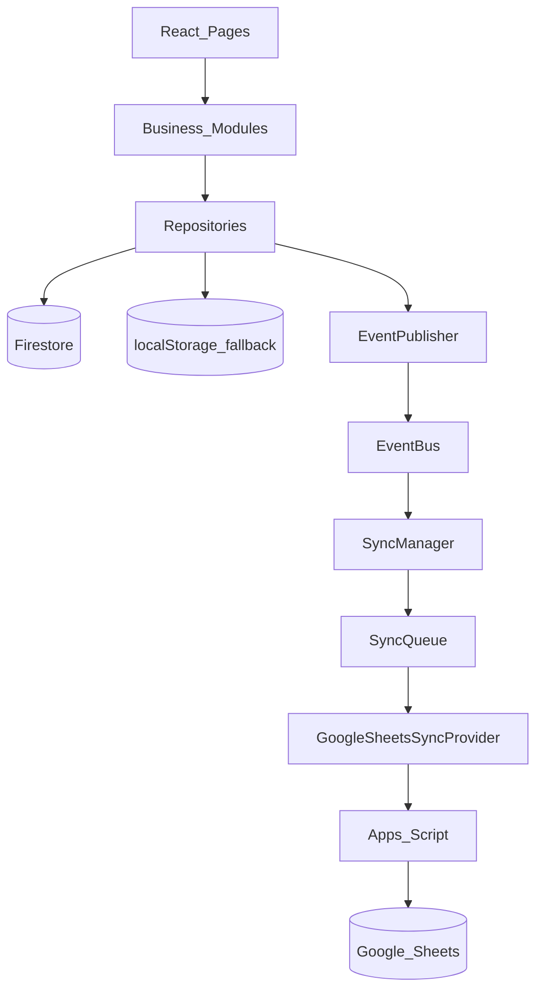

# RetailOS Developer Guide

## Adding a feature (example: Customer)

1. Add/extend types in `src/types` or the repository file.
2. Implement CRUD in `CustomerRepository` (Firestore collection `customers`).
3. Publish the right `EventTypes` after successful writes.
4. Expose `CustomerService` in `src/modules/customer` that only calls the repository.
5. UI pages call `CustomerService` — never `fetch` / Firestore / Sheets.

## Adding a sync destination (example: Tally)

1. Implement `SyncProvider` in `src/services/sync/TallySyncProvider.ts`.
2. Register it: `syncManager.registerProvider(new TallySyncProvider())` in bootstrap.
3. Do not touch React or Payment/Invoice modules.

## Adding a payment gateway

1. Implement `PaymentProvider` under `src/modules/payment/providers`.
2. Swap provider inside the payment module hook/service.
3. Still persist via `PaymentRepository.save/update` so events/sync keep working.

## Local vs cloud

| Mode | Behavior |
|------|----------|
| Firebase configured | Repository upserts Firestore + keeps local cache |
| Firebase unset | LocalStorage only; events + sync queue still run |
| Sheets URL unset | Sync queue completes with no-op provider skip |

## Debugging sync

- Queue: `localStorage["retailos.sync.queue.v1"]`
- Dead letters: `localStorage["retailos.sync.deadletter.v1"]`
- Event log: `localStorage["retailos.events.log.v1"]`

## Dependency graph (mermaid)

